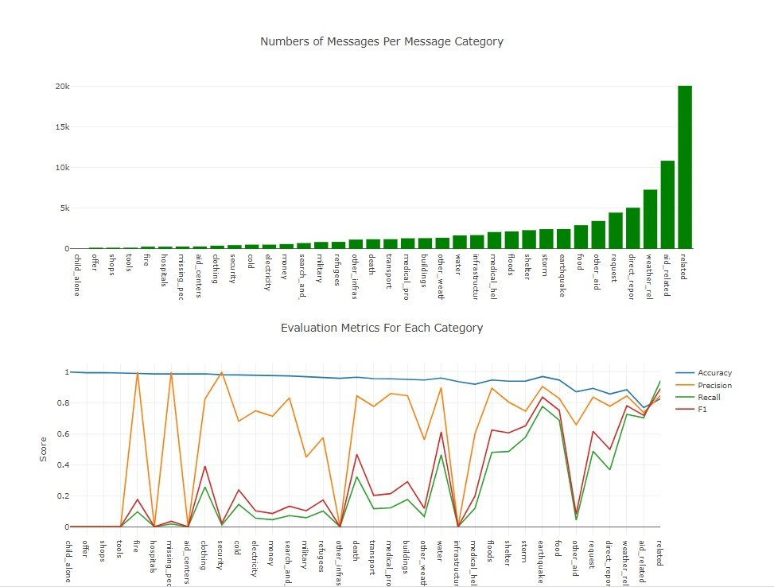
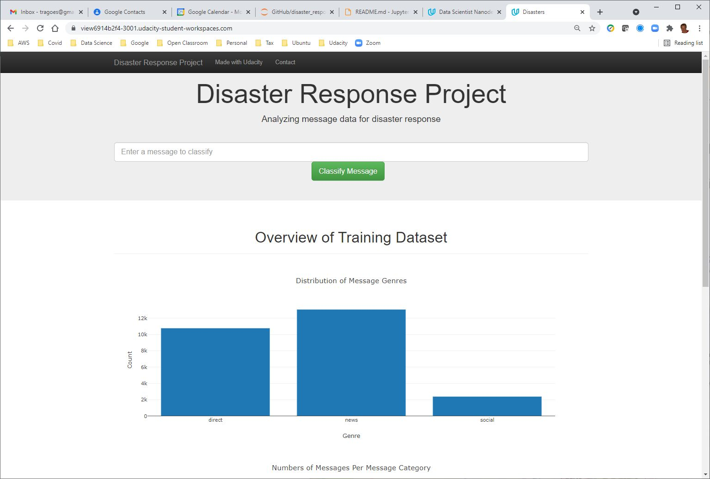
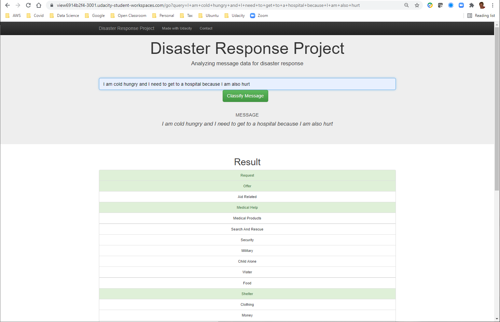

# Disaster Response Pipeline Project

## Author
* [Lindsay Moir](http://lindsaymoir.com/)

## Table of Contents

1. [Summary](#summary)
2. [Environment](#env)
3. [Instructions:](#instructions)
4. [Files](#files)
5. [ETL](#etl)
6. [Model](#model)
7. [Model Results](#result)
8. [Screenshots](#screenshots)
9. [Acknowledgements](#ack)

## Summary 

This is the third project in the second term of the Udacity Data Science NanoDegree (DSND).  [Figure Eight](https://en.wikipedia.org/wiki/Figure_Eight_Inc.) provided the data to Udacity and its students for this project. The input data consists of 26,249 messages from real disasters that were labelled by humans to act as a training set for Natural Language Processing (NLP) models.

The project consists of reading the input messages and the labelled dataset (36 categories) and creating a machine learning model that can accurately predict what the message's category (request, hospital, water, etc.) is. A web interface was also written in flask and python to provide an interface so that you can type your own message and see how the classifier does. There are also some visualizations of the data and the resultant scoring of the model that are available on the webpage.

The dataset is VERY imbalanced. As a result the precision, recall, and f1 scores vary dramatically as the model struggles to classify categories with little data. This visualization pretty much tells you the story. Accuracy is reasonable, the other metrics vary wildly by category.

## Environment 

- flask   	 1.1.2
- nltk		 3.5
- numpy		 1.20.3
- pandas		 1.1.3
- plotly		 4.14.3
- python		 3.8.0
- scikit-learn 0.24.2
- scipy		 1.6.3
- sqlite		 3.35.4

## Instructions 

To clone the github repository go to https://github.com/LindsayMoir/disaster_response_pipelines

Example:

(nlp)> cd data          # Change your working directory to data

(nlp)> python etl.py disaster_messages.csv disaster_categories.csv drp.db

(nlp) > cd models        # Change your working directory to models

(nlp) > python train_classifier.py ../data/drp.db model.pkl

(nlp) > cd app           # Change your working directory to app

(nlp) > python run.py

- go to http://0.0.0.0:3001/ in your web browser
Follow these instructions for running the web app at the * [Project Details Page](https://classroom.udacity.com/nanodegrees/nd025/parts/ba5d2f25-63d2-4db8-afb1-7a37dd792b4a/modules/1112326c-bdb1-4119-b907-4098a0e4277d/lessons/743ff0a6-7500-4de6-8477-ea822eeda8b8/concepts/6f0d69e6-1f5e-413e-8176-6b80a9bc8ad3)

## Files 

The following are the "important files". You can ignore the "others".

### app
* [**run.py**] Runs the webpage using the model, the sqlite database, and text messaages from the screen as input.
* [**tokenizer.py**] Tokenize code is packaged as a separate file due to issues with pickle not getting all of the class hierarchy of the model when pickling model.pkl. 

### data
* [**disaster_categories.csv**] Categories data set (labels) that is joined on the id column with the messages.
* [**disaster_messages.csv**] Messages data set.
* [**drp.db**] sqlite database that contains the messages (table) with the categories as well as a table for the scoring results (scores).
* [**etl.py**] Etract, Transform, Load (ETL) program that loads the sqlite database.

### models
* [**model.pkl**] model that is created by the classifer.
* [**train_classifier.py**] This is the program that trains the NLP pipeline on the messages and provides the model to classify future messages (data). 

### image
* [**img**] Scoring plot for accuracy, precision, recall, and f1. Other images for this ReadMe

## ETL 

The etl.py file in the data folder reads in the 2 .csv files, cleans them up, merges them, and then writes them to the drp.db sqlite database.

## Model 

1. Provides a tokenization function that cleans the data and then creates tokens (words) for the pipeline.
2. I use CountVectorizer and TfidfTransformer to create the vectors necessary for RandomForestClassifier to classify the messages. This is all done in a Pipeline to create more manageable and maintainable code. 
3. I used sklearn.train_test_split to create train and test sets for the pipeline.
4. I used GridSearchCV to manage the grid search and the Cross Fold Validation required for this project.
5. Then using GridSearchCv with 5 fold cross-validation I fitted 120 models to find the best random forest model for predicting the category. 
6. The best_estimator_ from these alternatives was saved as model.pkl and is used in the web app.

## Acknowledgements 

- Udacity for providing an amazing Data Science Nanodegree Program
- Figure Eight for providing the data to train the model

## Screenshots 

This is the frontpage:

By inputting a word, you can check its category:

   
